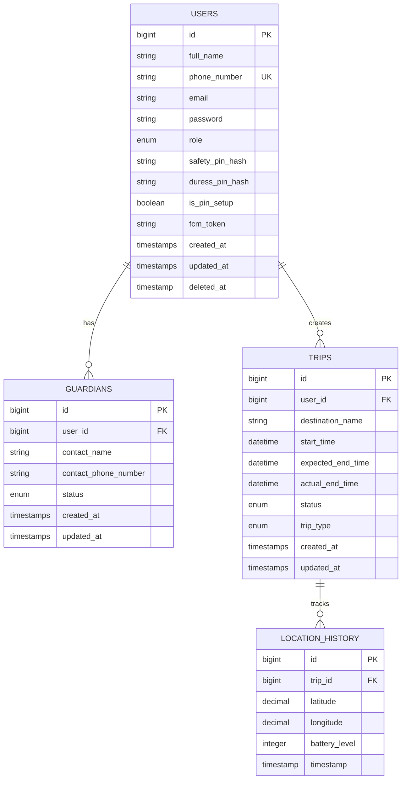

# 🗄️ SafeTrek Database Schema Documentation

## 📋 Overview

**Database System:** MySQL  
**Framework:** Laravel 11  
**Total Tables:** 4 core tables + 3 system tables  
**Timezone:** Asia/Ho_Chi_Minh (GMT+7)

---

## 📊 Entity Relationship Diagram



---

## 📁 Table Details

### 1️⃣ **users** (Người dùng)

**Purpose:** Lưu trữ thông tin người dùng và quản trị viên

| Column            | Type                  | Constraints        | Description                    |
| ----------------- | --------------------- | ------------------ | ------------------------------ |
| `id`              | BIGINT                | PK, AUTO_INCREMENT | ID người dùng                  |
| `full_name`       | VARCHAR(255)          | NOT NULL           | Họ và tên                      |
| `phone_number`    | VARCHAR(255)          | UNIQUE, NOT NULL   | Số điện thoại (đăng nhập)      |
| `email`           | VARCHAR(255)          | NULLABLE           | Email                          |
| `password`        | VARCHAR(255)          | NOT NULL           | Password (hashed)              |
| `role`            | ENUM('user', 'admin') | DEFAULT 'user'     | Vai trò                        |
| `safety_pin_hash` | VARCHAR(255)          | NULLABLE           | Safety PIN (hashed)            |
| `duress_pin_hash` | VARCHAR(255)          | NULLABLE           | Duress PIN (hashed)            |
| `is_pin_setup`    | BOOLEAN               | DEFAULT FALSE      | Đã setup PIN chưa              |
| `fcm_token`       | VARCHAR(255)          | NULLABLE           | Firebase Cloud Messaging token |
| `remember_token`  | VARCHAR(100)          | NULLABLE           | Laravel remember me token      |
| `created_at`      | TIMESTAMP             |                    | Ngày tạo                       |
| `updated_at`      | TIMESTAMP             |                    | Ngày cập nhật                  |
| `deleted_at`      | TIMESTAMP             | NULLABLE           | Soft delete                    |

**Indexes:**

- PRIMARY KEY (`id`)
- UNIQUE KEY (`phone_number`)

**Business Rules:**

- `phone_number` là credential chính để đăng nhập
- `safety_pin_hash` và `duress_pin_hash` phải khác nhau
- PIN được hash bằng Laravel Hash facade
- `is_pin_setup` = TRUE khi cả 2 PIN đã được set
- `role = 'admin'` để truy cập admin panel
- Soft delete: record không bị xóa vật lý, chỉ set `deleted_at`

---

### 2️⃣ **guardians** (Người bảo vệ)

**Purpose:** Danh sách người liên hệ khẩn cấp

| Column                 | Type                                    | Constraints             | Description         |
| ---------------------- | --------------------------------------- | ----------------------- | ------------------- |
| `id`                   | BIGINT                                  | PK, AUTO_INCREMENT      | ID guardian         |
| `user_id`              | BIGINT                                  | FK → users.id, NOT NULL | ID người dùng       |
| `contact_name`         | VARCHAR(255)                            | NOT NULL                | Tên người liên hệ   |
| `contact_phone_number` | VARCHAR(255)                            | NOT NULL                | SĐT người liên hệ   |
| `status`               | ENUM('pending', 'accepted', 'rejected') | DEFAULT 'pending'       | Trạng thái xác nhận |
| `created_at`           | TIMESTAMP                               |                         | Ngày thêm           |
| `updated_at`           | TIMESTAMP                               |                         | Ngày cập nhật       |

**Indexes:**

- PRIMARY KEY (`id`)
- FOREIGN KEY (`user_id`) REFERENCES `users(id)` ON DELETE CASCADE

**Business Rules:**

- Mỗi user tối đa **5 guardians**
- `status = 'accepted'`: Guardian đã xác nhận
- `status = 'pending'`: Chưa xác nhận
- `status = 'rejected'`: Từ chối
- Khi xóa user → tất cả guardians bị xóa (CASCADE)
- Chỉ guardian `status = 'accepted'` mới nhận alerts

**Relationships:**

- **BELONGS TO** `users` (Many-to-One)

---

### 3️⃣ **trips** (Chuyến đi)

**Purpose:** Lưu trữ thông tin chuyến đi và trạng thái

| Column              | Type         | Constraints             | Description                |
| ------------------- | ------------ | ----------------------- | -------------------------- |
| `id`                | BIGINT       | PK, AUTO_INCREMENT      | ID chuyến đi               |
| `user_id`           | BIGINT       | FK → users.id, NOT NULL | ID người dùng              |
| `destination_name`  | VARCHAR(255) | NULLABLE                | Tên điểm đến               |
| `start_time`        | DATETIME     | NOT NULL                | Thời gian bắt đầu          |
| `expected_end_time` | DATETIME     | NOT NULL                | Thời gian dự kiến kết thúc |
| `actual_end_time`   | DATETIME     | NULLABLE                | Thời gian kết thúc thực tế |
| `status`            | ENUM         | DEFAULT 'active'        | Trạng thái chuyến đi       |
| `trip_type`         | ENUM         | DEFAULT 'timer'         | Loại chuyến đi             |
| `created_at`        | TIMESTAMP    |                         | Ngày tạo                   |
| `updated_at`        | TIMESTAMP    |                         | Ngày cập nhật              |

**ENUM Values:**

**`status`:**

- `active` - Đang diễn ra
- `completed` - Đã hoàn thành (Safety PIN)
- `alerted` - Hết thời gian (Timer Expired)
- `panic` - Panic button activated
- `duress_ended` - Kết thúc bằng Duress PIN

**`trip_type`:**

- `timer` - Chuyến đi thông thường với timer
- `panic` - Panic từ trang chủ (không có trip thật)
- `duress` - _(Reserved for future use)_

**Indexes:**

- PRIMARY KEY (`id`)
- FOREIGN KEY (`user_id`) REFERENCES `users(id)` ON DELETE CASCADE
- INDEX (`status`) - For scheduler queries

**Business Rules:**

- Một user chỉ có **1 trip active** tại một thời điểm
- `destination_name` nullable cho panic trips
- `actual_end_time` = NULL khi trip đang active
- Khi xóa user → tất cả trips bị xóa (CASCADE)
- Scheduler check trips với `status = 'active'` mỗi phút

**Trip Lifecycle:**

```
START TRIP
    ↓
[status: active]
    ↓
    ├─→ Safety PIN → [status: completed]
    ├─→ Duress PIN → [status: duress_ended] + Alert
    ├─→ Panic → [status: panic] + Alert
    └─→ Timer Expired → [status: alerted] + Alert (sau 60s)
```

**Relationships:**

- **BELONGS TO** `users` (Many-to-One)
- **HAS MANY** `location_history` (One-to-Many)

---

### 4️⃣ **location_history** (Lịch sử vị trí)

**Purpose:** Tracking GPS và battery level trong chuyến đi

| Column          | Type           | Constraints               | Description        |
| --------------- | -------------- | ------------------------- | ------------------ |
| `id`            | BIGINT         | PK, AUTO_INCREMENT        | ID record          |
| `trip_id`       | BIGINT         | FK → trips.id, NOT NULL   | ID chuyến đi       |
| `latitude`      | DECIMAL(10, 8) | NOT NULL                  | Vĩ độ              |
| `longitude`     | DECIMAL(11, 8) | NOT NULL                  | Kinh độ            |
| `battery_level` | INTEGER        | NULLABLE                  | % pin (0-100)      |
| `timestamp`     | TIMESTAMP      | DEFAULT CURRENT_TIMESTAMP | Thời gian ghi nhận |

**Indexes:**

- PRIMARY KEY (`id`)
- FOREIGN KEY (`trip_id`) REFERENCES `trips(id)` ON DELETE CASCADE
- INDEX (`trip_id`) - High-volume queries

**Business Rules:**

- GPS coordinates: WGS84 format
  - `latitude`: -90 to 90 (8 decimals = ~1mm precision)
  - `longitude`: -180 to 180 (8 decimals = ~1mm precision)
- `battery_level`: 0-100 hoặc NULL
- Mobile app gửi location update mỗi **30 giây** khi trip active
- Khi xóa trip → tất cả location history bị xóa (CASCADE)

**Query Pattern:**

```sql
-- Lấy vị trí cuối cùng của trip
SELECT * FROM location_history
WHERE trip_id = ?
ORDER BY timestamp DESC
LIMIT 1;

-- Lấy toàn bộ route
SELECT * FROM location_history
WHERE trip_id = ?
ORDER BY timestamp ASC;
```

**Relationships:**

- **BELONGS TO** `trips` (Many-to-One)

---

## 🔗 Relationships Summary

| Relationship             | Type        | Foreign Key                | On Delete |
| ------------------------ | ----------- | -------------------------- | --------- |
| users → guardians        | One-to-Many | `guardians.user_id`        | CASCADE   |
| users → trips            | One-to-Many | `trips.user_id`            | CASCADE   |
| trips → location_history | One-to-Many | `location_history.trip_id` | CASCADE   |

---

## 📈 Data Flow Examples

### **Example 1: Start Trip Flow**

```sql
-- 1. Create trip
INSERT INTO trips (user_id, destination_name, start_time, expected_end_time, status, trip_type)
VALUES (1, 'Bệnh viện Bạch Mai', '2026-01-04 10:00:00', '2026-01-04 10:30:00', 'active', 'timer');

-- 2. Save initial location
INSERT INTO location_history (trip_id, latitude, longitude, battery_level, timestamp)
VALUES (1, 21.0285, 105.8542, 85, NOW());
```

### **Example 2: Timer Expired Alert Query**

```sql
-- Scheduler tìm trips hết hạn (sau 60s grace period)
SELECT t.*, u.full_name, u.phone_number
FROM trips t
JOIN users u ON t.user_id = u.id
WHERE t.status = 'active'
  AND t.expected_end_time <= DATE_SUB(NOW(), INTERVAL 60 SECOND);

-- Lấy vị trí cuối trong alert
SELECT * FROM location_history
WHERE trip_id = ?
ORDER BY timestamp DESC
LIMIT 1;
```

### **Example 3: Get User with Relations**

```sql
-- User + Guardians + Active Trip
SELECT
    u.*,
    g.contact_name, g.contact_phone_number, g.status as guardian_status,
    t.destination_name, t.status as trip_status
FROM users u
LEFT JOIN guardians g ON u.id = g.user_id
LEFT JOIN trips t ON u.id = t.user_id AND t.status = 'active'
WHERE u.id = 1;
```

---

## 🔐 Security Considerations

**Sensitive Data:**

- `password`: Hashed với bcrypt
- `safety_pin_hash`: Hashed với bcrypt
- `duress_pin_hash`: Hashed với bcrypt
- `fcm_token`: Firebase token

**Best Practices:**

- Không bao giờ log PIN plaintext
- API responses không trả về password/PIN
- Duress PIN response giống Safety PIN (để lừa attacker)
- Soft delete cho users (compliance)

---

## 📊 Indexing Strategy

**Current Indexes:**

1. `users.phone_number` - UNIQUE (login queries)
2. `guardians.user_id` - FK index (cascade deletes)
3. `trips.user_id` - FK index (user's trips)
4. `trips.status` - Query active trips for scheduler
5. `location_history.trip_id` - FK index (route queries)

**Recommended Additional Indexes (if needed):**

```sql
-- If querying trips by date frequently
CREATE INDEX idx_trips_start_time ON trips(start_time);

-- If filtering guardians by status
CREATE INDEX idx_guardians_status ON guardians(status);
```

---

## 🧪 Sample Data

```sql
-- Admin user
INSERT INTO users (full_name, phone_number, password, role)
VALUES ('Admin', '0123456789', '$2y$12$...', 'admin');

-- Regular user with PINs
INSERT INTO users (full_name, phone_number, password, safety_pin_hash, duress_pin_hash, is_pin_setup)
VALUES ('Nguyễn Văn A', '0987654321', '$2y$12$...', '$2y$12$...', '$2y$12$...', TRUE);

-- Guardian
INSERT INTO guardians (user_id, contact_name, contact_phone_number, status)
VALUES (2, 'Người thân A', '0912345678', 'accepted');

-- Active trip
INSERT INTO trips (user_id, destination_name, start_time, expected_end_time, status, trip_type)
VALUES (2, 'Bệnh viện', NOW(), DATE_ADD(NOW(), INTERVAL 30 MINUTE), 'active', 'timer');
```

---

## 📝 Notes

- All timestamps use `Asia/Ho_Chi_Minh` timezone
- Soft deletes preserve user data for compliance
- Foreign key constraints ensure referential integrity
- CASCADE deletes prevent orphaned records
- Migrations use Laravel 11 schema builder

---

**Last Updated:** 2026-01-04  
**Version:** 1.0
